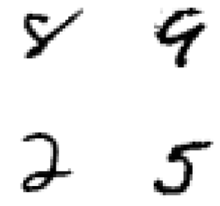

# Neural Network using Backpropagation to classify images into 1 out of 10 categories
Backpropagation algorithm written in C to train and classify handwritten numbers (0-9) from [MNIST](http://yann.lecun.com/exdb/mnist/) dataset.



## C Version
### Dataset
Although the original dataset contains 70 thousand samples, this algorithm uses only 6 thousand images for training (```test-6k-images-labels```) and 4 thousand for testing (```test-4k-images-labels```) the network.

### Build
```gcc final.c -o final.x -Wall -Wextra -g -std=c99 -lm -O0 -fPIC```

### Train and Run
```
-h  help
-t  train a neural network
-r  run the saved neural network
```

## Matlab Version
### Dataset
Now we use the whole dataset for training and testing the neural network. First we extract all images into a ```.mat``` matrix using the function below. Make sure the original data files are in the same folder as the functions are running.

```Matlab
trainset = trainDB(60000);
testset  = testDB (10000);
```

### Train and Test
```Matlab
% start training the network with learning rate = 0.06
% W and B are weights and bias
[W1,W2,W3,B1,B2,B3] = Backprop(trainset, 0.06);

% now the neural network is tested and returns 'p' as the precision percentage
p = testNN(W1,W2,W3,B1,B2,B3,testset);
```
